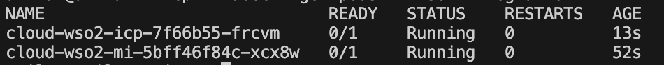
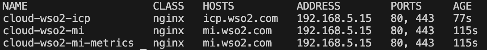
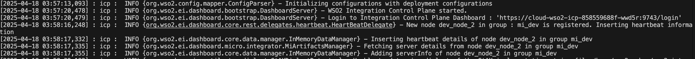

# Kubernetes Deployment Guide for WSO2 Micro Integrator (MI) and Integration Control Plane (ICP)

This guide provides step-by-step instructions to deploy WSO2 Micro Integrator (MI) and Integration Control Plane (ICP) in a Kubernetes environment using Helm charts. Both MI and ICP will be deployed in the same namespace for seamless integration.

---

## Prerequisites

1. **Git**: Install [Git](https://git-scm.com/book/en/v2/Getting-Started-Installing-Git) on your machine.
2. **Helm**: Install [Helm](https://helm.sh/docs/intro/install/) (version 3 or later) on your machine.
3. **Kubernetes Cluster**: Ensure you have an operational Kubernetes cluster (e.g. AKS, EKS, GKE, or a local Kubernetes cluster).
4. **Ingress Controller**: Deploy an ingress controller (e.g. [NGINX Ingress Controller](https://kubernetes.github.io/ingress-nginx/deploy/)).
5. **Docker Images**: Acquire WSO2 product Docker images. Push them to a container registry (e.g. ACR, ECR, GCR) if necessary.
6. **WSO2 Subscription**: A valid WSO2 subscription is required to access Docker images from the **WSO2 private registry**. If you don't have a subscription, sign up for a [ WSO2 Free Trial Subscription ](https://wso2.com/subscription/).

---

## Deploy a Local Setup

### 1. Set Up a Local Kubernetes Cluster

You can utilize either **Minikube** or **Rancher Desktop** to establish a local Kubernetes cluster:

#### Using Minikube

1. Install Minikube by following the [official documentation](https://minikube.sigs.k8s.io/docs/start/).
2. Start a Minikube cluster:
   ```bash
   minikube start
   ```
3. Enable the [NGINX ingress](https://kubernetes.github.io/ingress-nginx/deploy/#minikube) controller:
   ```bash
   minikube addons enable ingress
   ```

#### Using Rancher Desktop

1. Install Rancher Desktop from the [official website](https://rancherdesktop.io/).
2. Configure Rancher Desktop to use Kubernetes and set the desired Kubernetes version.
3. Ensure the [NGINX ingress](https://kubernetes.github.io/ingress-nginx/deploy/#rancher-desktop) controller is installed.

### 2. Clone the Helm Chart Repository
Clone the Helm chart repository containing the MI and ICP Helm charts:
```bash
git clone https://github.com/wso2/helm-mi.git
```

Checkout to your preferred MI runtime version branch:
```bash
cd helm-mi
git checkout origin/4.5.x
```

### 3. Create a Namespace
Create a unified namespace for both MI and ICP:
```bash
kubectl create namespace wso2-integration
```

### 4. Configure Values for MI and ICP

#### Configurations
 - Edit the `mi/values_local.yaml` file to configure MI-specific parameters.
 - Edit the `icp/values_local.yaml` file to configure ICP-specific parameters.

> [!IMPORTANT] 
> The configurations described below apply to both MI and ICP deployments. Ensure that the parameters are correctly set in the respective `values_local.yaml` files for seamless functionality.

##### Container Registry and Server Image
If you intend to use the WSO2 released server image, obtain a [subscription](https://wso2.com/subscription/) and update the following configurations:
```yaml
containerRegistry: "wso2"

wso2:
  subscription:
        username: "<username>"
        password: "<password>"
```

If you are using your own customized MI server images, set `containerRegistry` to the specific private docker registry:
```yaml
containerRegistry: "<private-registry-name>"

wso2:
    deployment:
        imagePullSecrets: "<image-pull-secret>"
        image:
            repository: "<image-name>"
            digest: "<image-digest>"
            tag: "<image-tag>"
            pullPolicy: IfNotPresent
```
When running on a local Kubernetes cluster using a local image, leave this empty:
```yaml
containerRegistry: ""

wso2:
    deployment:
        image:
            repository: "<image-name>"
            digest: "<image-digest>"
            tag: "<image-tag>"
            pullPolicy: IfNotPresent
```
##### User Stores
###### File-based user store (default)

> [!NOTE] 
> The `values_local.yaml` is preconfigured to use a file-based user store by default. If you wish to proceed with this configuration, skip the following section. 
> - You can use default ADMIN user [username='admin', password='admin'] for testing purposes.

###### LDAP user store

Example for READ ONLY LDAP:
```yaml
wso2:
    config:
        userstore:
            file:
                enabled: false
            ldap:
                type: "read_only_ldap"
                connectionUrl: "ldap://{hostname}:{port}"
                connectionName: "uid=admin,ou=system"
                connectionPassword: "admin"
                userSearchBase: "ou=Users,dc=wso2,dc=org"
```

Refer to [MI documentation](https://mi.docs.wso2.com/en/latest/reference/config-catalog-mi/#external-user-store) for complete list of parameters.

###### RDBMS user store

Example for MySQL:
```yaml
wso2:
    config:
        userstore:
            file:
                enabled: false
            rdbms:
                url: "jdbc:mysql://{hostname}:{port}/userdb"
                username: "<username>"
                password: "<password>"
                jdbc:
                    driver: "com.mysql.jdbc.Driver"
                    poolParameters:
                        maxActive: 50
                        maxWait: 60000
```

Refer to [MI documentation](https://mi.docs.wso2.com/en/latest/install-and-setup/setup/user-stores/setting-up-a-userstore-in-icp/#configure-an-rdbms-user-store:~:text=RDBMS%20user%20store-,%C2%B6,-Before%20you%20begin) for more information on supporting RDBMS types.


> [!NOTE] 
> When using RDBMS, the JDBC driver must be added to the `<SERVER_HOME>/lib` folder. To achieve this, you need to build a custom server image. 


Follow these steps below to add JDBC driver:
 1. Create the Dockerfile 
    - BASE_IMAGE:
        * MI: `wso2/wso2mi:4.5.0`
        * ICP: `wso2/wso2-integration-control-plane:1.0.0`
    - WSO2_SERVER_HOME:
        * MI: `/home/wso2carbon/wso2mi-4.5.0`
        * ICP: `/home/wso2carbon/wso2-integration-control-plane-1.0.0`
    
    Example for MySQL:

    ```yaml
        FROM <BASE_IMAGE>
        USER root
        RUN apt-get update && \
            apt-get install -y wget && \
            apt-get clean && \
            rm -rf /var/lib/apt/lists/*
        ENV WSO2_SERVER_HOME=<WSO2_SERVER_HOME>
        RUN mkdir -p ${WSO2_SERVER_HOME}/lib
        ARG JDBC_DRIVER_URL=https://dev.mysql.com/get/Downloads/Connector-J/mysql-connector-j-8.0.33.tar.gz
        RUN wget -O /tmp/mysql-connector.tar.gz "${JDBC_DRIVER_URL}" && \
            tar -xzf /tmp/mysql-connector.tar.gz -C /tmp && \
            find /tmp -name "mysql-connector*.jar" -exec cp {} ${WSO2_SERVER_HOME}/lib/ \; && \
            rm -rf /tmp/mysql-connector.tar.gz
        RUN chown -R wso2carbon:wso2 ${WSO2_SERVER_HOME}/lib && \
            chmod -R 755 ${WSO2_SERVER_HOME}/lib
        USER wso2carbon
    ```
 2. Build the image:
    ```yaml
    docker build -t customized-wso2-img:1.0.0 .
    ```    
 3. Update the following configurations in `values_local.yaml`:
    ```yaml
    containerRegistry: ""
    wso2:
        deployment:
            image:
                repository: "customized-wso2-img"
                tag: "1.0.0"
                pullPolicy: IfNotPresent
    ```   


> [!TIP] 
> For integration development, if you are using the [MI VSCode extension](https://marketplace.visualstudio.com/items/?itemName=WSO2.micro-integrator), you can **add JDBC drivers to MI server image** by placing the JAR file in the `<PROJECT_DIR>/deployment/libs` folder and then clicking "Create Docker Image" under Deployment Options. This will build the Docker image and push it to the local registry. 
> - Add following instruction to '<PROJECT_DIR>/deployment/docker/Dockerfile'. Please make sure that only JDBC driver resides in '<PROJECT_DIR>/deployment/libs' folder.
>   - COPY libs/*.jar ${WSO2_SERVER_HOME}/lib/
        

<figure style="width: 80%; height: auto; text-align: center; margin: 20px;">
    
    <figcaption>Add JDBC JAR to '/deployment/libs' folder</figcaption>
</figure>

<figure style="width: 80%; height: auto; text-align: center; margin: 20px;">
    
    <figcaption>Click Create Docker Image Button to build integration docker image</figcaption>
</figure>

### 5. Deploy MI and ICP

#### Deploy MI
Navigate to the `mi` directory and deploy MI using Helm:
```bash
cd mi
helm install wso2-mi ./ -f values_local.yaml --namespace wso2-integration
```

#### Deploy ICP
Navigate to the `icp` directory and deploy ICP using Helm:
```bash
cd icp
helm install wso2-icp ./ -f values_local.yaml --namespace wso2-integration
```

### 6. Verify the Deployment

#### Check Pods
Ensure all pods are running:
```bash
kubectl get pods -n wso2-integration
```

<figure style="width: 100%; height: auto; margin-left: 0px;">
    <figcaption style="text-align: center;">List of running pods</figcaption>
    
</figure>

#### Check Services
Verify that services are exposed:
```bash
kubectl get svc -n wso2-integration
```

<figure style="width: 100%; height: auto; margin-left: 0px; text-align: center;">
    <figcaption style="text-align: center;">List of Services</figcaption>
    
</figure>

#### Check Ingress
Confirm ingress resources:
```bash
kubectl get ingress -n wso2-integration
```
<figure style="width: 100%; height: auto; margin-left: 0px;">
    <figcaption style="text-align: center;">List of ingress</figcaption>
    
</figure>

> [!TIP]
> The HOST of the Ingress is the hostname specified in the `values_local.yaml` file. The default values are,
> - MI : mi.wso2.com
> - ICP : icp.wso2.com

#### Check Server Logs
```bash
kubectl logs <pod-name> -n wso2-integration
```
<figure style="width: 100%; height: auto; margin-left: 0px;">
    <figcaption style="text-align: center;">Server Logs</figcaption>
    
</figure>

### 7. Access the MI and Integration Control Plane (ICP) 

#### Access through Ingress controller

Please follow these steps 

1. Get the external IP (EXTERNAL-IP) of the Ingress resources by listing the Kubernetes ingresses.
    ```bash
        kubectl get ingress -n wso2-integration
    ```

2. Add the host information to your /etc/hosts file.
    ```bash
    <EXTERNAL-IP>   mi.wso2.com 
    <EXTERNAL-IP>   icp.wso2.com 
    ```

3. Now you can access as follows    
    - Access the ICP dashboard at `https://icp.wso2.com/login`.
    - Invoke the MI integrations as `curl https://mi.wso2.com/<resource-path> -k`.

#### Invoke without Ingress controller

You can also invoke the MI integration solutions and ICP without going through the Ingress controller by using the [port-forward](https://kubernetes.io/docs/tasks/access-application-cluster/port-forward-access-application-cluster/#forward-a-local-port-to-a-port-on-the-pod) method for services.

For ICP:
 ```bash
    kubectl port-forward service/cloud-wso2-icp -n wso2-integration 8080:9743
 ```
Then, you can access the ICP dashboard at `https://localhost:8080/login`.

For MI Integrations:
```bash
    kubectl port-forward service/cloud-wso2-mi -n wso2-integration 8290:8290
 ```
Then, you can invoke the MI integrations as `curl https://localhost:8290/<resource-path> -k`.

---

## Deploy with a Cloud Service Provider (CSP)

### 1. Set Up a Kubernetes Cluster
Provision a Kubernetes cluster using a CSP (e.g., AKS, EKS, GKE). Follow the respective CSP official documentation for cluster setup.

### 2. Push Docker Images to a Container Registry
Push the WSO2 product Docker images to the CSP's container registry (e.g., ACR for Azure, ECR for AWS, GCR for Google Cloud).

### 3. Configure Values for MI and ICP
Update the `values.yaml` files for MI and ICP to use the container registry paths and CSP-specific configurations (e.g. storage classes, load balancer annotations).

### 4. Deploy MI and ICP
Follow the same deployment steps as in the local setup, ensuring the `values.yaml` files are updated for the CSP environment.

### 5. Verify and Access
Validate the deployment and access the applications using the CSP's load balancer or ingress configurations.

### Supported Cluster providers

* [Amazon Elastic Kubernetes Service (EKS)](https://aws.amazon.com/eks/)

    Refer [EKS Configs](./EXAMPLES.md#amazon-elastic-kubernetes-service-eks) section to configure the required parameters to run MI in EKS.

* [Azure Kubernetes Service (AKS)](https://azure.microsoft.com/en-us/services/kubernetes-service/)

    Refer [AKS Configs](./EXAMPLES.md#azure-kubernetes-service-aks) section to configure the required parameters to run MI in AKS.

* [Google Kubernetes Engine (GKE)](https://cloud.google.com/kubernetes-engine)

    Refer [GKE Configs](./EXAMPLES.md#google-kubernetes-engine-gke) section to configure the required parameters to run MI in GKE.

---

## Cleanup

To delete the deployments:
```bash
helm uninstall wso2-mi -n wso2-integration
helm uninstall wso2-icp -n wso2-integration
kubectl delete namespace wso2-integration
```

---

## References

- [WSO2 Documentation](https://mi.docs.wso2.com/)
- [Helm Documentation](https://helm.sh/docs/)
- [Kubernetes Documentation](https://kubernetes.io/docs/)

---

This guide provides a foundational setup. For advanced configurations, refer to the `CONFIG.md` and `EXAMPLES.md` files in the respective Helm chart directories.
